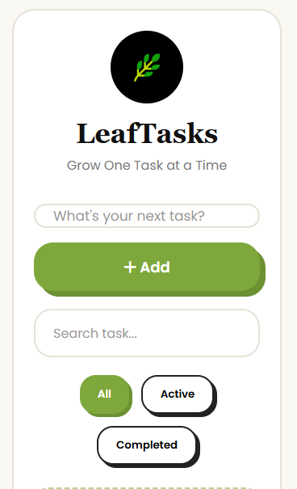

<h1 align="center">Leaf — Task Manager</h1>


<p align="center">
A simple to-do list app that lets you add, search, filter, and track tasks — with everything saved to your browser so your list survives a refresh. Built with HTML, CSS, and JavaScript while practicing localStorage, filtering, and dynamic rendering.
</p>

<p align="center">
  <strong><a href="https://your-deployment-link.netlify.app/">🌐 Live Demo</a></strong>
</p>

---

##  Preview

<p align="center">
  
</p>

<!--##  Demo
<p align="center">
  
</p>
----->

##  Features

- Add tasks by clicking the button or pressing Enter
- Mark tasks as complete with a checkbox
- Delete tasks individually
- Live search — filters the task list as you type
- Filter tasks by All / Active / Completed
- Task counter showing total and completed tasks
- Empty state message when no tasks match the current view
- Tasks persist across page reloads using `localStorage`

---

##  Built With

- HTML5
- CSS3
- JavaScript (ES6)

---

## Getting Started

Clone the repository:
```bash
git clone https://github.com/chitrangna-dev/leaf-task-manager.git
```

Move into the project folder:
```bash
cd leaf-task-manager
```

Open `index.html` in your preferred web browser.

---

##  Why I Built This

I built this to get more comfortable with rendering dynamic lists from an array of objects, keeping the UI in sync with that array on every add, delete, and toggle, and persisting state using `localStorage` so data isn't lost on refresh.

---

## Possible Improvements

- Add task editing instead of only add/delete
- Add due dates and sort tasks by them
- Add drag-and-drop reordering of tasks
- Show a confirmation before deleting a task

---

##  Author

**Chitrangna**
Passionate about building web applications and improving my JavaScript skills through hands-on projects.
Feel free to explore the project or share your feedback.

---

##  License

This project is licensed under the MIT License.
